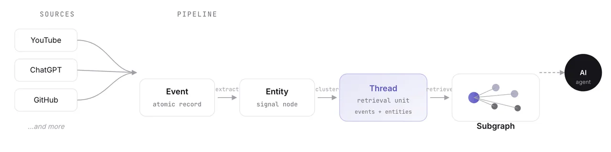

## The Problem

Imagine you're deep into a brainstorming session with an AI, going back and forth for an hour - and then the free tier rate limit hits. Now you have to switch to another AI and re-explain everything from scratch. The context, the problem, what you've tried, where you're stuck. All of it.

Because you're the only one who knows what you're working on, to query any AI assistant you have to carry all that knowledge alone, every single time.

## The Solution: Meniscus

So two weeks ago, during an offline hackathon - I built a small version of my idea - **Meniscus** - a layer that sits outside your tools and holds that knowledge for you. One shared picture of your current working state: what you've tried, what's blocking you, what's been decided. Any AI you switch to reads from it instead of starting from zero.

The core idea:

> Context shouldn't live inside individual tools. It should live outside as a separate external layer and AI tools should read from it.

Right now, you're the only one who knows what you're working on right now and you got to query any AI assistant you got to carry all that knowledge alone. *Meniscus is the layer that finally holds that knowledge for you.*

It captures user activity across tools, structures it into threads - which are the core working units representing what the user is actively doing - and lets you retrieve relevant context as a subgraph instead of raw history.

## The Architecture

The architecture consists of three primitives:

1. **Event** is the atomic unit - an immutable, timestamped record of one thing you did. Asked ChatGPT something, watched a YouTube video, made a GitHub commit, updated a Notion page -- each one captured, normalized, stored.

2. An **entity** is a meaningful concept extracted from an event. Not the full text -- just the signal. "JWT", "middleware", "refresh token", "auth" - the keywords that actually tell you what the event was about.

3. A **thread** is a cluster of related events - not similar in the textual sense, but connected by shared work context. "I am debugging a JWT auth bug" is a thread. It spans a GitHub commit, a ChatGPT conversation, a Notion architecture doc, a YouTube video on token expiry. Individually those events look unrelated and together they're one line of work.

## The Pipeline

The pipeline goes like this:

→ activity comes in
→ entities get extracted
→ each new event gets compared against existing threads by entity overlap and temporal proximity
→ assigned to the right thread or a new one gets created
→ the whole thing is stored as a graph with explicit edges between events, entities, and threads.

When an agent queries Meniscus, it doesn't get a raw dump of your history. It gets a subgraph - the relevant thread, its events, its entities. A bounded, structured slice of context instead of everything at once. The agent injects that into its prompt and answers grounded in your actual work.

## The Demo

For the demo of the project, here's what I did:

- simulated events from ChatGPT, YouTube and GitHub -- 4 threads from a realistic day of work, 12 events total.
- the query system routes through three modes: Retrieve (traverses through the entities) --> Overview (cross-thread summary of what you've been doing) --> General (conversational, if there's nothing relevant to retrieve, it says "i don't know").

## Reality Check

Whenever starting with a project, I like to think on the lines of SHOULDs -- how something should be done and question my own decisions aggressively at every step before I can come to an architecture that I deem to be good enough.

Whatever was showed in the demo, it was only a small part of the whole implementation I had planned. When the hackathon ended, after 2 days I decided to sit with my project once again and finish the remaining implementation. However I found some major loopholes and realized whatever I am doing is nothing different from what already exists - Zep, Mem0, Supermemory, Rewind etc.

*most of what I built is already there, and in better shape than I could ship.*

External memory layers, graph storage, episodic retrieval, agent APIs - these are solved or being actively solved by well-funded teams. Hence no point in redoing the same.

> However there's one specific architectural component that is the only differentiating factor and it got a persisting question surrounding it, which I need to research upon thoroughly before coming to a conclusion.

## The Differentiator

Every existing system retrieves by similarity - cosine distance, semantic search, ranked chunks. You ask a question, it finds the most textually similar pieces of your history and hands them back.

But "what am I currently working on" isn't a similarity problem. It's a working state problem. The agent doesn't need the most similar chunks. it needs the current state of an ongoing task - what the goal is, what's been tried, what's blocking progress, what's been decided. Those are different questions and similarity search doesn't answer them cleanly.

## Why Not Just Use Long Context?

Then the obvious question is - what about just dumping everything into a long context window? frontier models like Gemini and Claude have massive context windows. Why not hand them your entire history and let them figure out the working state themselves?

And honestly, they'd do a decent job. give Claude enough of your activity and it can synthesize "what you're working on" reasonably well. but three problems:

- **1st, cost.** Sending hundreds of thousands of tokens on every single query isn't free at scale.

- **2nd, the lost-in-the-middle problem** - empirically documented, models perform worse on information buried deep in long contexts. *More tokens doesn't mean better reasoning over those tokens.*

- **3rd, even if the model synthesizes working state correctly from raw history, it's doing that work fresh every single time you query it.** *Meniscus does it once* and maintains it continuously. The synthesis is already done when the agent needs it.

## Next Steps: The Benchmark

Here are two hypotheses -

1. Thread-state packet retrieval produces better agent answers to active working state queries than hybrid search.

2. Thread-state packet retrieval injects fewer tokens for the same query - because a structured state object is already present there for agent to retrieve.

I might have guessed the answers but need to be very sure and the honest thing to do is build a benchmark, compare thread-state packet retrieval against state of the art retrieval methods on active working state queries, measure token count and answer quality, and write about what I find.
